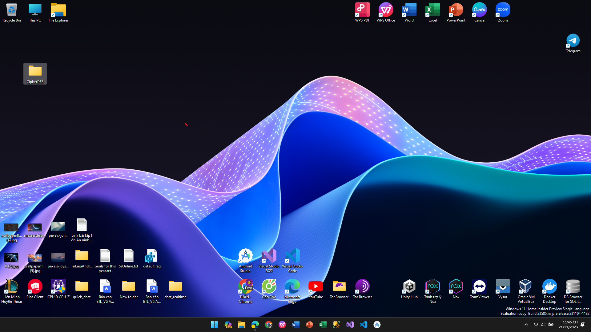
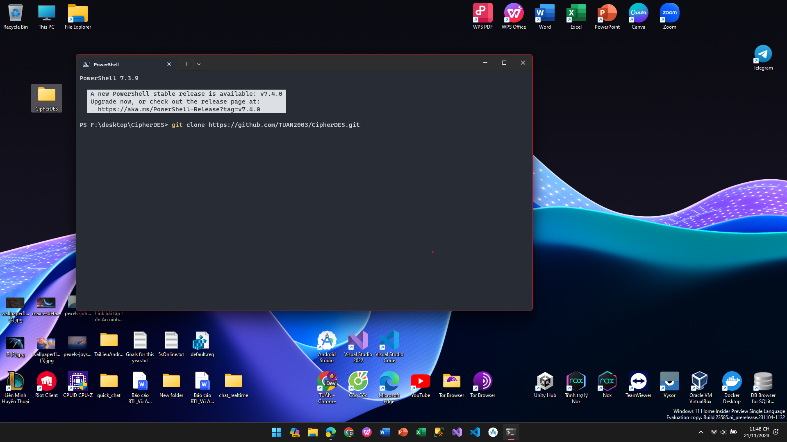

# WinFormsEncryptionDES

## Feature
- Encoding with input (a piece of text or a piece of Hex code) into a piece -> Hex encoding
- And Decryption
## Algorithms Used
- DES
- 3DES
## Installation
- Step 1: On the main Desktop screen, create new folder here, example: CipherDES

- Step 2: Right click on the newly created folder and select "Open in terminal" and enter the command:
```sh
git clone https://github.com/TUAN2003/CipherDES.git
```

- Step 3: completed and you can go to the folder and check the soucre code
