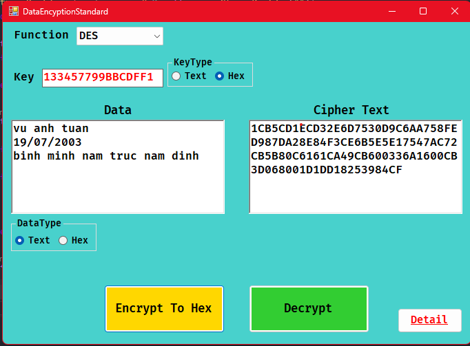

# WinFormsEncryptionDES

## Feature
- Encoding with input (a piece of text or a piece of Hex code) into a piece -> Hex encoding
- And Decryption
## Algorithms Used
- DES
- 3DES
## Installation
- Step 1: On the main Desktop screen, create new folder here, example: CipherDES
